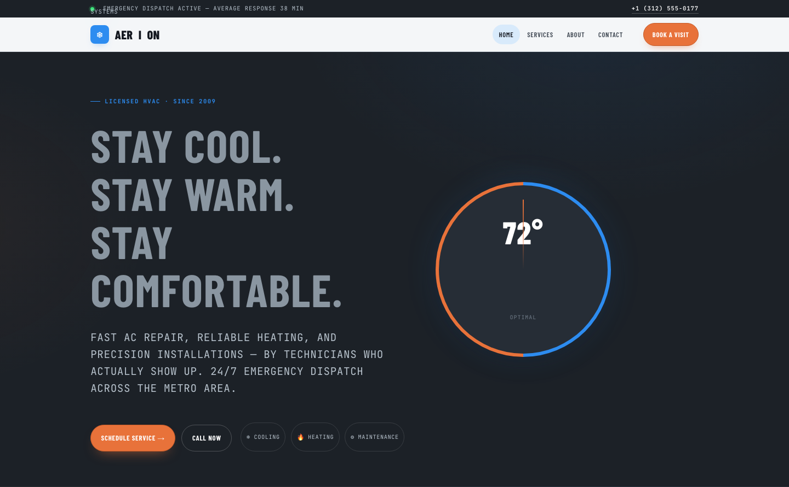

# ZEPHYR — Cool Air, Calmly Delivered

> **Premium AC & Climate Service Template** — A spa-calm, light-and-airy website for air conditioning, heating, and indoor climate companies. Frosted glass, sky-blue gradients, and an interactive temperature slider that tints the hero as you set your ideal comfort.

**Live preview:** `index.html` (open in browser)
**Stack:** HTML5 · CSS3 (custom properties, Grid, Flex) · Vanilla JS (no build step)
**Fonts:** Fraunces (elegant serif display) · Outfit (geometric sans body) — via Google Fonts
**License:** MIT — use commercially, modify freely.

---

## 📸 Screenshot



## Pages

| Page | Description | Link |
|------|-------------|------|
| **Home** | Readiness bar, sky-gradient hero with **interactive temperature slider** (drag 60–90°F to tint the scene ice-cool ↔ sunset-warm), floating hero image with comfort chips, count-up stats strip, 6 service cards, 3-step "how it works", feature split with written-diagnostics promise, 3-tier pricing, testimonials, FAQ accordion, CTA band | [index.html](index.html) |
| **About** | Page head, count-up stats, company story split, 6 operating principles on deep-ink section, team photo grid, CTA | [about.html](about.html) |
| **Services** | Page head, 5 detailed service modules (AC repair, heating, installations, maintenance, indoor air quality) in alternating image/text splits, 24/7 comfort-line band, service-area coverage grid, CTA | [service.html](service.html) |
| **Contact** | Frosted-glass booking form with service type + equipment + urgency selects, inline validation (no `alert()`), info cards (comfort line, email, office, licensing) | [contact.html](contact.html) |

---

## ⚡ The Wow Moment

The hero features a **temperature slider** (`#tempthermo`, 60–90°F). Drag it and the entire scene breathes: the background tint transitions from **ice-cool blue** (low temps) to **sunset-warm amber** (high temps) via a `--tint-ratio` custom property, while a live serif readout and a mode badge ("Cooling" / "Comfortable" / "Warming") update in real time. It's a topic-native interaction no HVAC template has — and it degrades gracefully to a static tint without JavaScript.

---

## 🎨 Design System

| Token | Value | Usage |
|-------|-------|-------|
| `--ice` | `#22D3EE` | Primary accent — CTAs, highlights, slider |
| `--sky` | `#E4F0FA` | Cool-breeze gradient base |
| `--frost` | `#F5F9FF` | Page ground, glass surfaces |
| `--amber` | `#F59E0B` | Warm secondary — heat/cool duality, stars |
| `--ink` | `#0B2E4A` | Deep navy — headings, footer, top bar |

**Typography:** Fraunces (display serif, soft and elegant) + Outfit (geometric sans body)
**Materials:** Frosted-glass cards (`backdrop-filter: blur(16px) saturate(1.2)`), soft gradient blobs, rounded-2xl corners, gentle layered shadows
**Motion:** Gentle float animation, evaporate-in scroll reveals (IntersectionObserver, staggered `.d1`–`.d4`), full `prefers-reduced-motion` support

---

## 📁 File Structure

```
ac-repair-html-template/
├── index.html          # Home page
├── about.html          # About / Our Story
├── service.html        # Services detail
├── contact.html        # Contact / Book a Visit
├── README.md           # This file
└── assets/
    ├── css/
    │   └── base.css    # Complete design system (~680 lines)
    ├── js/
    │   └── main.js     # Vanilla interactions (~150 lines)
    └── img/            # 14 original source images
```

---

## ✨ Features

- **Interactive temperature slider** — drag 60–90°F to tint the hero cool↔warm with live readout + mode badge
- **Frosted-glass UI** — `backdrop-filter` glass cards, chips, and form on a sky-gradient ground
- **Readiness top bar** — pulsing "Ready today" badge + 24/7 comfort-line phone
- **Count-up stats strip** — Fraunces numerals animate from 0 on scroll
- **Service grid** — 6 cards with icon tiles, descriptions, and topic tags
- **"How it works" steps** — numbered 3-step process cards
- **Feature split** — diagnostic promise with icon checklist
- **3-tier pricing** — featured tier with ice accent + badge
- **Testimonials** — star ratings with initial avatars
- **FAQ accordion** — rotating + toggle, `aria-expanded` state
- **CTA band** — dual-action (schedule + call)
- **Contact form** — service type + equipment + urgency selects, inline validation, no `alert()`
- **Scroll reveals** — IntersectionObserver with staggered delays
- **Active nav** — auto-highlight via `location.pathname`
- **Footer year** — `[data-year]` auto-fills current year
- **Reduced motion** — `@media (prefers-reduced-motion)` disables all animation
- **Original imagery** — 14 source images in `assets/img/`: `AirCon.jpg`, `carousel-1/2.jpg`, `feature.jpg`, `about-1/2/3/4.jpg`, `service-1/2/3/4/5/6.jpg`

---

## 🚀 Quick Start

```bash
# No install, no build — just open
open index.html
# or serve locally
npx serve .
```

---

## 🎛️ Customization

- **Colors:** Edit `:root` tokens in `assets/css/base.css` — `--ice` (cyan), `--amber` (warm), `--sky`/`--frost` (gradient ground), `--ink` (deep navy)
- **Fonts:** Swap the Google Fonts `<link>` in each HTML `<head>` and update `--font-display` / `--font-body`
- **Temperature slider:** Adjust `min`, `max`, `step`, and `value` on `#tempthermo` in `index.html`
- **Services:** Add/remove `.service-card` items in `.services-grid` on each page
- **Pricing:** Edit `.plan` tiers in `index.html` — pricing, features, tier count
- **Contact details:** Update phone, email, office, and licensing in every footer + `contact.html`

---

## 🔍 SEO Keywords

AC repair · air conditioning service · HVAC maintenance · heating and cooling · climate control · indoor air quality · new installation · 24/7 HVAC service · ductless mini-split · furnace repair

---

## 🌐 Browser Support

Modern evergreen browsers (Chrome 90+, Firefox 88+, Safari 14+, Edge 90+).
Graceful degradation: CSS custom properties, Grid, Flex, `clamp()`, `backdrop-filter`, `IntersectionObserver` — all degrade or polyfill cleanly.

---

## 🙏 Credits

- **Images:** Original source assets (included in `assets/img/`)
- **Fonts:** Fraunces (Undercase Type), Outfit (Roderick Dykeman) — SIL OFL via Google Fonts
- **Icons:** Inline Unicode (❄ ☀ ◎ ✦ ✓ ★ ☰ ☎) — no icon-font dependency

---

Let's Build Something Together 🚀
https://tally.so/r/q4q1L9
